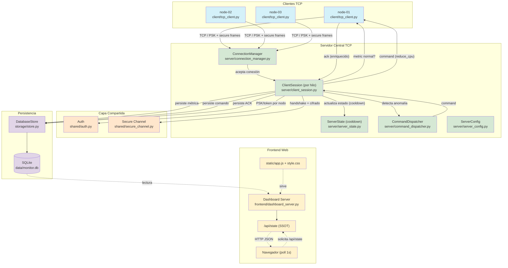
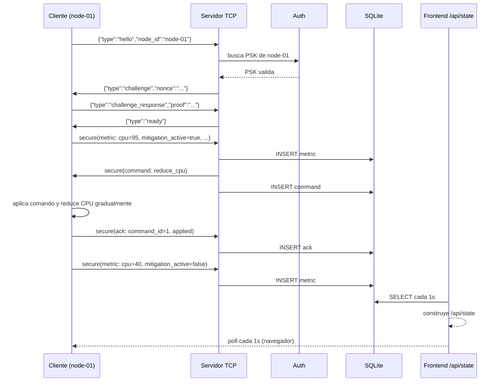
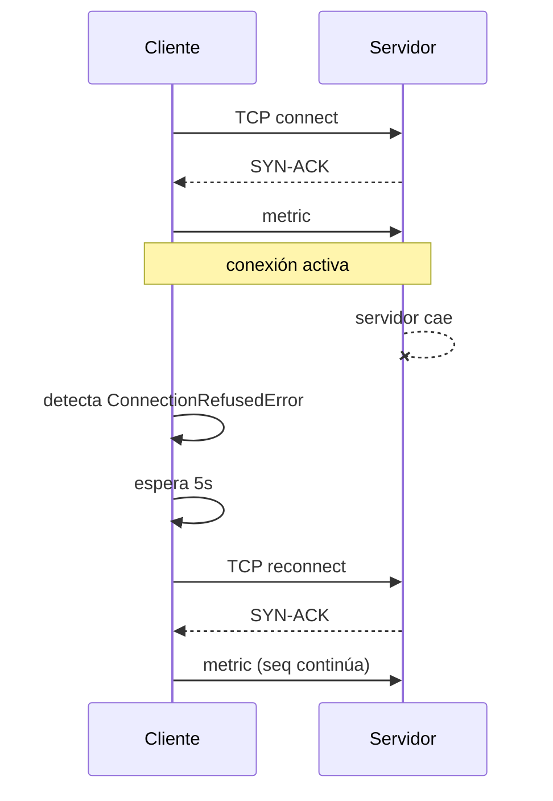

# Diagrama de arquitectura



## Flujo de mensajes



## Flujo de reconexión



## Componentes del frontend

```
┌──────────────────────────────────────────┐
│  Navegador Web                           │
│  ┌────────────────────────────────────┐  │
│  │  Dashboard HTML (index.html)        │  │
│  │  ┌──────────────┐ ┌─────────────┐  │  │
│  │  │ Panel nodos  │ │ Gráfico     │  │  │
│  │  │ (tabla)      │ │ (CPU/RAM/   │  │  │
│  │  │              │ │  latencia)  │  │  │
│  │  └──────────────┘ └─────────────┘  │  │
│  │  ┌──────────────┐ ┌─────────────┐  │  │
│  │  │ Eventos      │ │ Logs        │  │  │
│  │  │ (comandos +  │ │ (sistema)   │  │  │
│  │  │  ACKs)       │ │             │  │  │
│  │  └──────────────┘ └─────────────┘  │  │
│  │  ┌──────────────────────────────┐  │  │
│  │  │  Controles de escenario      │  │  │
│  │  └──────────────────────────────┘  │  │
│  └────────────────────────────────────┘  │
│  Polling: GET /api/state cada 1000ms     │
└──────────────────────────────────────────┘
```
